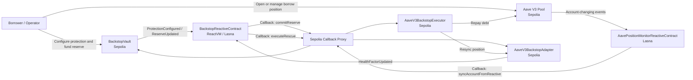

# Backstop

Backstop is a Reactive Network project for autonomous liquidation protection.

It watches borrower risk on Sepolia, mirrors protection policy inside ReactVM, and automatically posts callback transactions that commit reserve capital and repay debt when a position falls below a configured safety threshold.

## Why Backstop

Liquidation defense is still mostly bot-driven, manual, or single-chain. Users often keep reserves on one chain while debt sits on another, which makes fast intervention hard exactly when market conditions worsen.

Backstop uses Reactive Network for the part normal smart contracts cannot do on their own:

- subscribe to third-party protocol events
- react without a backend keeper
- coordinate callbacks across contracts after the trigger is observed

## What This Repo Proves

- a working local rescue flow with Foundry tests
- a live Aave V3 Sepolia integration path
- a live Sepolia plus Reactive Lasna proof set
- a successful end-to-end clean-stack rescue on March 27, 2026

## Live Proof

Successful clean-stack rescue:

- `sync trigger`: [`0x5ddf2ecf3ec382e42cccdae2879d231f550ffaf83629813bf7614455f9cc6ece`](https://sepolia.etherscan.io/tx/0x5ddf2ecf3ec382e42cccdae2879d231f550ffaf83629813bf7614455f9cc6ece)
- `reserve commit callback`: [`0xbdb2de69ed59aae282eec72f3390c5380330864b3c8a12a4001097cfcc232d7c`](https://sepolia.etherscan.io/tx/0xbdb2de69ed59aae282eec72f3390c5380330864b3c8a12a4001097cfcc232d7c)
- `rescue execution callback`: [`0x1859c3b12093a21db8dbb351bc36f45070a281c029335996bf5e5efec3ab4242`](https://sepolia.etherscan.io/tx/0x1859c3b12093a21db8dbb351bc36f45070a281c029335996bf5e5efec3ab4242)

Observed end state:

- reserve committed on Sepolia
- rescue executor liquidity fully consumed
- borrower variable debt reduced by about `25 USDC`

## Architecture



- `BackstopVault`
  - stores protection policy and reserve balances
  - accepts reserve-commit callbacks from Reactive

- `BackstopReactiveContract`
  - subscribes to policy, reserve, and risk events
  - mirrors protection state inside ReactVM
  - emits reserve and rescue callbacks when a position breaches policy

- `AaveV3BackstopAdapter`
  - reads live Aave account data on Sepolia
  - emits normalized `HealthFactorUpdated` events

- `AaveV3BackstopExecutor`
  - receives Sepolia callbacks
  - repays live Aave debt with prefunded liquidity

- `AavePositionMonitorReactiveContract`
  - watches raw Aave Pool events
  - requests Sepolia adapter syncs when tracked accounts change

## Repository Layout

- `src/backstop`
  - contracts and project docs

- `script`
  - deployment, setup, replay, sync, and inspection scripts

- `test`
  - Foundry coverage for local and protocol-facing flows

- `broadcast`
  - recorded public proof runs

## Quick Start

Install Foundry:

```bash
curl -L https://foundry.paradigm.xyz | bash
foundryup
```

Clone and install submodules:

```bash
git clone https://github.com/lawesst/Backstop.git
cd Backstop
git submodule update --init --recursive
```

Run tests:

```bash
forge test
```

Run the demo UI:

```bash
node script/backstop/serve-backstop-ui.mjs
```

Then open `http://localhost:4173`.

## Docs

- technical design: `src/backstop/README.md`
- testnet runbook and proof history: `src/backstop/TESTNET.md`
- example environment file: `.env.backstop.example`

## Known Hardening Work

- `Automate Lasna coverDebt()`
  - add a pre-flight and post-run maintenance step that checks the Reactive contract debt and settles it before additional rescue cycles are triggered.

- `Automate callback-proxy top-ups`
  - add balance checks and deterministic top-ups for the Sepolia callback targets so reserve and rescue callbacks stay funded across repeated runs.

- `Make the clean-stack path one-command reproducible`
  - fold Sepolia deploy, raw Lasna deploy, watcher registration, reserve seeding, callback funding, and health-check scripts into a single reproducible orchestration flow.

- `Next product hardening`
  - add reserve replenishment through a settlement or bridge layer and extend support beyond a single borrower and market configuration.
